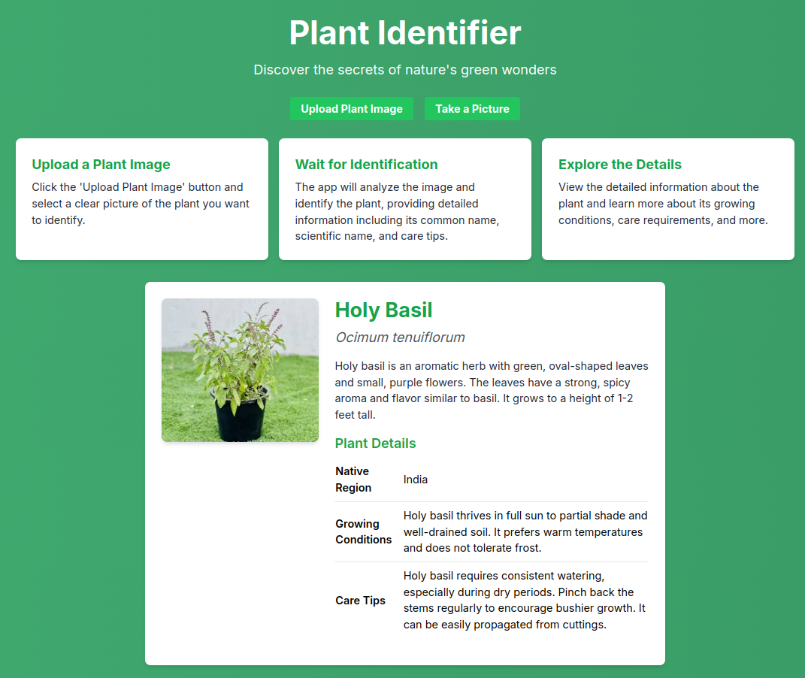

# BotanIQ : Plant Identifier App

A web application that uses AI to identify plants from images. Users can either upload an image or take a picture directly using their device's camera, and the app provides detailed information about the plant, including its common name, scientific name, description, growing conditions, and care tips in an aesthetic user interface.



## Features

- **Upload Plant Image**: Users can upload an image of a plant from their device to identify it.
- **Take a Picture**: Users can directly take a picture of a plant using their device's camera for identification.
- **AI-Powered Identification**: The app uses AI to analyze the image and provide detailed information about the plant.
- **User-Friendly Interface**: Simple, intuitive interface with instructions on how to use the app.
- **Dynamic Background**: A moving green gradient background for a visually appealing experience.

## Getting Started

Follow these instructions to get a copy of the project up and running on your local machine for development and testing purposes.

### Prerequisites

- **Node.js**: Ensure you have Node.js installed on your machine. You can download it from [Node.js official website](https://nodejs.org/).
- **npm**: Node Package Manager, which comes with Node.js, is needed to install dependencies.

### Installation

1. **Clone the Repository**:

   ```bash
   git clone https://github.com/abhishekbiju/botanIQ-plant-identifier.git
